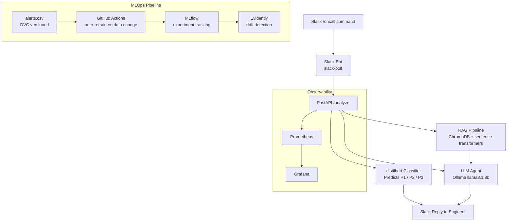
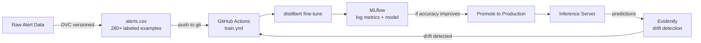

# SRE AI Copilot

An AI-powered on-call assistant that analyzes Slack alerts in under 10 seconds. When an alert fires, the bot automatically fetches logs, searches runbooks, classifies severity, and replies with a root cause analysis — so engineers spend time fixing, not diagnosing.

---

## Demo

```
/oncall HighMemoryUsage on service payments-api
```

```
Severity: P2
Likely cause: memory leak, OOMKilled event detected.
Runbook says: kubectl rollout undo deployment/payments-api
Relevant logs: ERROR OOMKilled: container exceeded memory limit
```

---

## Architecture



---

## Tech Stack

| Layer | Tool |
|---|---|
| LLM | Ollama + llama3.1:8b (local, no paid APIs) |
| Vector DB | ChromaDB |
| Embeddings | sentence-transformers |
| Severity Classifier | Fine-tuned distilbert (HuggingFace) |
| Experiment Tracking | MLflow |
| Data Versioning | DVC |
| Drift Detection | Evidently |
| API | FastAPI |
| Slack Bot | Slack Bolt SDK |
| Metrics | Prometheus + Grafana |
| CI/CD | GitHub Actions |
| Deployment | Docker + Kubernetes/Helm |

---

## MLOps Pipeline



- Training data versioned with DVC — full reproducibility
- Every experiment logged in MLflow: accuracy, F1, confusion matrix
- GitHub Actions auto-retrains the classifier when `data/alerts.csv` changes
- Evidently monitors incoming alert distribution against training data — triggers retraining on drift

---

## Project Structure

```
sre-ai-copilot/
├── agent/
│   ├── analyze.py          # Core agent: fetches logs, calls LLM
│   ├── tools.py            # get_logs, get_runbook tool functions
│   ├── rag.py              # ChromaDB vector search over runbooks
│   └── memory.py           # Conversation memory
├── api/
│   └── main.py             # FastAPI POST /analyze endpoint
├── bot/
│   └── slack.py            # Slack bot /oncall slash command
├── classifier/
│   ├── train.py            # Fine-tune distilbert on alert data
│   ├── evaluate.py         # Evaluate model metrics
│   ├── predict.py          # Predict severity for new alerts
│   └── promote.py          # Promote model to production in MLflow
├── data/
│   └── alerts.csv          # 280+ labeled training alerts (DVC versioned)
├── runbooks/               # Markdown runbooks indexed into ChromaDB
├── monitoring/
│   ├── drift.py            # Evidently drift detection
│   ├── prometheus.yml      # Prometheus scrape config
│   └── alerts.yaml         # Alertmanager rules
├── k8s/
│   └── rbac.yml            # Kubernetes RBAC for the bot
├── .github/
│   └── workflows/
│       └── train.yml       # Auto-retrain CI pipeline
└── docker-compose.yml      # Full stack: API + Bot + Prometheus + Grafana
```

---

## Setup

### Prerequisites

- Python 3.12
- [Ollama](https://ollama.com) installed and running
- `llama3.1:8b` pulled: `ollama pull llama3.1:8b`
- Docker + Docker Compose

### Install

```bash
git clone https://github.com/nourdz5/sre-ai-copilot.git
cd sre-ai-copilot
python -m venv venv
source venv/bin/activate
pip install -r requirements.txt
```

### Configure

```bash
cp .env.example .env
# fill in SLACK_BOT_TOKEN and SLACK_APP_TOKEN
```

### Run locally

```bash
# Index runbooks into ChromaDB
python agent/rag.py

# Train the classifier
python classifier/train.py

# Start the API
uvicorn api.main:app --reload

# Start the Slack bot (new terminal)
python bot/slack.py
```

### Run with Docker

```bash
docker-compose up --build
```

MLflow UI: `http://localhost:5000`
Grafana: `http://localhost:3000`

---

## CI/CD Notes

The `drift-check` and `train` jobs in GitHub Actions include a `dvc pull` step. This step will fail in CI because no DVC remote storage is configured (the project runs fully locally with no cloud storage). In a production setup, this would point to an S3 or GCS bucket. The rest of the pipeline (drift detection, training, evaluation) works correctly once data is available locally.

---

## Key Design Decisions

- **Local LLM (Ollama)** — no API costs, no data leaving the machine, production-swappable to any OpenAI-compatible endpoint
- **Separate classifier + LLM** — fast severity triage (distilbert, ~50ms) happens before the slow LLM call, so P1 alerts are flagged immediately
- **DVC for data versioning** — any past experiment is fully reproducible; retraining is deterministic
- **Drift-triggered retraining** — model stays accurate as alert patterns evolve without manual intervention
